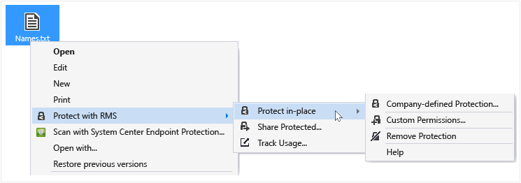

# Beskytte en fil p&#229; en enhet (beskytte p&#229; plass) ved hjelp av rettighetsadministrasjon deling av program
Når du beskytter en fil i stedet, erstatter den opprinnelige, ubeskyttet fil. Du kan la filen der det er, kopiere den til en annen mappe eller enhet, eller dele mappen den er i, og filen er beskyttet. Du kan også knytte den beskyttede filen til en e-postmelding, selv om det er den anbefalte måten å dele en beskyttet fil via e-post direkte fra File Explorer eller et Office-program (se [Beskytte en fil du deler via e-post ved hjelp av rettighetsadministrasjon deling av program](../Topic/Protect_a_file_that_you_share_by_email_by_using_the_Rights_Management_sharing_application.md)).

> [!TIP]
> Hvis du ser feilmeldinger når du prøver å beskytte filer, kan du se [Vanlige spørsmål om Microsoft Rights Management deling av programmer for Windows](http://go.microsoft.com/fwlink/?LinkId=303971).

## Beskytte en fil på en enhet (beskytte på stedet)

1.  Velg en fil for å beskytte i File Explorer. Høyreklikk, velg **Beskytt med RMS**, og velg deretter **beskytte på stedet**. For eksempel:

    

    > [!NOTE]
    > Hvis du ikke ser den **Beskytt med RMS** alternativet, er det sannsynlig at enten RMS deling program ikke er installert på datamaskinen eller datamaskinen må startes på nytt for å fullføre installasjonen. Hvis du vil ha mer informasjon om hvordan du installerer RMS deling program, se [Last ned og installer rettighetsadministrasjon deling av program](../Topic/Download_and_install_the_Rights_Management_sharing_application.md).

2.  Gjør ett av følgende:

    -   Velg en policymal for: Disse er forhåndsdefinerte tillatelser som vanligvis begrenser tilgang og bruk til personer i organisasjonen. Hvis navnet på organisasjonen er "Contoso Ltd.", kan du se **Contoso, Ltd. - konfidensiell Vis bare**. Hvis dette er første gang du har beskyttet en fil på denne datamaskinen, må du først velge **selskapsdefinerte beskyttelse** å laste ned maler.

        Neste gang du klikker på **beskytte på stedet** alternativet, vil du se opptil 10 maler å velge mellom. Hvis det er mer enn 10 maler som er tilgjengelige, og det du vil ha ikke vises, klikker du **selskapsdefinerte beskyttelse** å laste ned og vise alle maler.

        Når du velger en mal i gruppepolicy, kan du også beskytte flere filer og en mappe. Når du velger en mappe, blir alle filene i mappen velges automatisk for beskyttelse, men nye filer du oppretter i denne mappen ikke automatisk beskyttet.

    -   Velg **egendefinerte tillatelser**: Velg dette alternativet hvis malene ikke gir beskyttelsesnivået som du trenger, eller du vil angi alternativer for passordbeskyttelse eksplisitt selv. Angi alternativene du vil bruke for denne filen i den [Beskyttelse dialogboksen Legg til](http://technet.microsoft.com/library/dn574738.aspx), og klikk deretter **Bruk**.

3.  Du kan raskt se en dialogboks for å fortelle deg at filen er beskyttet, og returnerer deretter fokus til Filutforsker. Den valgte filen eller filene er nå beskyttet. I noen tilfeller (ved å legge til beskyttelse endres filtypen) den opprinnelige filen i File Explorer er erstattet med en ny fil som har låseikonet for Rights Management-beskyttelse. For eksempel:

    

Hvis du senere trenger å fjerne beskyttelsen fra en fil, kan du se [Fjerne beskyttelsen fra en fil ved hjelp av rettighetsadministrasjon deling av program](../Topic/Remove_protection_from_a_file_by_using_the_Rights_Management_sharing_application.md).

## Eksempler og andre instruksjoner
For eksempler på hvordan du kan bruke IRM deling av programmet, og hvordan-instruksjoner, kan du se følgende deler fra Rights Management-brukerhåndboken for deling program:

-   [Eksempler for å bruke RMS deling av program](../Topic/Rights_Management_sharing_application_user_guide.md#BKMK_SharingExamples)

-   [Hva vil du gjøre?](../Topic/Rights_Management_sharing_application_user_guide.md#BKMK_SharingInstructions)

## Se også
[Rights Management deling program Brukerhåndbok](../Topic/Rights_Management_sharing_application_user_guide.md)

