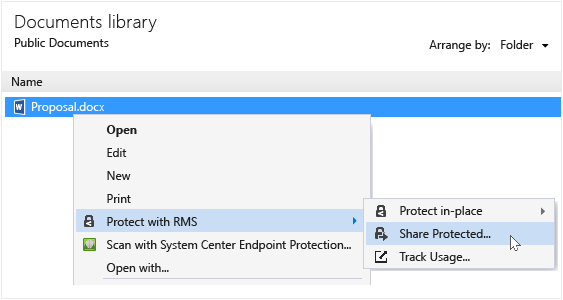
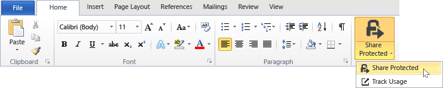

# Beskytte en fil du deler via e-post ved hjelp av rettighetsadministrasjon deling av program
Når du beskytter en fil du deler via e-post, opprettes det en ny versjon av den opprinnelige filen. Den opprinnelige filen forblir ubeskyttet og den nye versjonen er beskyttet og automatisk knyttet til en e-postmelding som du sender.

I noen tilfeller (for filer som er opprettet av Microsoft Word, Excel og PowerPoint), oppretter RMS deling program to versjoner av filen som den kobles til e-postmeldingen. Den andre versjonen av filen har en **.ppdf** filtypen, og det er en PDF-skyggekopi av filen. Denne versjonen av filen sikrer at mottakerne kan lese filen alltid, selv om de ikke har installert det samme programmet som du brukte for å opprette den. Dette er ofte tilfellet når personer leser e-posten på mobile enheter, og ønsker å se deres e-postvedlegg. Alt de trenger for å åpne filen, er RMS deling av programmet. Deretter, de kan lese den vedlagte filen, men de kan ikke endre det før de åpner den andre versjonen av filen ved å bruke et program som støtter RMS.

Hvis organisasjonen bruker Azure RMS, du kan holde oversikt over filene som du beskytter ved å dele:

-   Velg et alternativ for å motta e-post når noen prøver å åpne disse vedleggene som er beskyttet. Hver gang filen åpnes, får du beskjed som prøvde å åpne filen, og når og om de var vellykket (de ble godkjent) eller ikke.

-   Bruke dokumentasjonen for sporingsområdet. Du kan selv avslutte deling av filen, ved å oppheve tilgang til den i dokumentet sporingsområdet. Hvis du vil ha mer informasjon, se [Spore og oppheve dokumentene når du bruker RMS deling av program](../Topic/Track_and_revoke_your_documents_when_you_use_the_RMS_sharing_application.md).

## Ved hjelp av Outlook: Beskytte en fil du deler via e-post

1.  Opprette e-postmeldingen og legge ved filen. På den **meldingen** -kategorien i den **RMS** gruppen, klikker du **del beskyttet** og deretter **del beskyttet** på nytt:

    

    Hvis du ikke ser denne knappen, er det sannsynlig at enten RMS deling program ikke er installert på datamaskinen, den nyeste versjonen er ikke installert, eller datamaskinen må startes på nytt for å fullføre installasjonen. Hvis du vil ha mer informasjon om hvordan du installerer programmet deling, se [Last ned og installer rettighetsadministrasjon deling av program](../Topic/Download_and_install_the_Rights_Management_sharing_application.md).

2.  Angi alternativene du vil bruke for denne filen i den [dele beskyttet dialogboksen](http://technet.microsoft.com/library/dn574738.aspx), og klikk deretter **Send nå**.

### Andre måter å beskytte en fil du deler via e-post
I tillegg til å dele en beskyttet fil ved hjelp av Outlook, kan du også bruke disse alternativene:

-   Fra File Explorer: Denne metoden fungerer for alle filer.

-   Fra et Office-program: Denne metoden fungerer for programmer som støtter RMS deling av programmer ved hjelp av Office-tillegget, slik at du kan se den **RMS** gruppen på båndet.

##### Ved hjelp av File Explorer eller et Office-program: Beskytte en fil du deler via e-post

1.  Bruk en av følgende alternativer:

    -   For File Explorer: Høyreklikk filen, velger du **Beskytt med RMS**, og velg deretter **del beskyttet**:

        

    -   For den Office-programmer, Word, Excel og PowerPoint: Kontroller at du har lagret filen først. På den **Hjem** -kategorien i den **RMS** gruppen, klikker du **del beskyttet** og deretter **del beskyttet** på nytt:

        

    Hvis du ikke ser disse alternativene for beskyttelse, er det sannsynlig at enten RMS deling program ikke er installert på datamaskinen, den nyeste versjonen er ikke installert, eller datamaskinen må startes på nytt for å fullføre installasjonen. Hvis du vil ha mer informasjon om hvordan du installerer programmet deling, se [Last ned og installer rettighetsadministrasjon deling av program](../Topic/Download_and_install_the_Rights_Management_sharing_application.md).

2.  Angi alternativene du vil bruke for denne filen i den [dele beskyttet dialogboksen](http://technet.microsoft.com/library/dn574738.aspx), og klikk deretter **sende**.

3.  Du kan raskt se en dialogboks for å fortelle deg at filen er beskyttet, og deretter vil du se en e-postmelding opprettet for deg som ber mottakerne om at vedleggene er beskyttet med Microsoft RMS, og at de må logge seg på. Når de klikker koblingen for å logge på, kan de se instruksjoner og koblinger for å sikre at de kan åpne vedlegget beskyttet.

    Eksempel:

    

    Du lurer på: [Hva er filen .ppdf som er opprettet automatisk?](../Topic/Dialog_box_options_for_the_Rights_Management_sharing_application.md#BKMK_PPDF)

4.  Valgfritt: Du kan endre alt i denne e-postmeldingen. Du kan for eksempel legge til eller endre emnet eller teksten i meldingen.

    > [!WARNING]
    > Selv om du kan legge til eller fjerne brukere fra denne e-postmeldingen, dette endrer ikke tillatelsene for vedlegg som er angitt i den **del beskyttet** dialogboks. Hvis du vil endre tillatelser, for eksempel gi en ny person tillatelse til å åpne filen, lukker du e-postmeldingen uten å lagre eller sende den, og gå tilbake til trinn 1.

5.  Send e-postmeldingen.

## Eksempler og andre instruksjoner
For eksempler på hvordan du kan bruke IRM deling av programmet, og hvordan-instruksjoner, kan du se følgende deler fra Rights Management-brukerhåndboken for deling program:

-   [Eksempler for å bruke RMS deling av program](../Topic/Rights_Management_sharing_application_user_guide.md#BKMK_SharingExamples)

-   [Hva vil du gjøre?](../Topic/Rights_Management_sharing_application_user_guide.md#BKMK_SharingInstructions)

## Se også
[Rights Management deling program Brukerhåndbok](../Topic/Rights_Management_sharing_application_user_guide.md)

