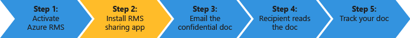
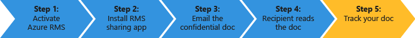

# Rask Start oppl&#230;ring for Azure Rights Management
Bruk denne opplæringen til raskt å teste Microsoft Azure Rights Management (også kjent som Azure RMS) for din organisasjon med bare 5 trinn som skal ta mindre enn 15 minutter. Du må aktivere tjenesten trygt sende konfidensielt dokument via e-post til noen i en annen organisasjon og kunne spore når dokumentet åpnes. Når konfidensielt dokument er e-postmelding, er kryptert under overføringen, og kan bare leses av personen det er sendt til, ved hjelp av tillatelsene som er angitt av avsenderen.

Denne opplæringen er rettet mot IT-ansvarlige og konsulenter, slik at de kan evaluere Azure rettighetsadministrasjon som en løsning for beskyttelse av informasjon for en organisasjon. I et produksjonsmiljø, instruksjonene for å aktivere tjenesten ville bli utført av en administrator, og instruksjonene for å sende dokumentet vil bli utført av sluttbrukere. Begge settene med instruksjonene er inkludert i denne opplæringen, til å vise ende-til-ende-scenariet av konfidensielle dokumenter på en sikker måte sendes til noen i en annen organisasjon. Hvis du har problemer med å fullføre denne opplæringen, kan du sende en e-postmelding til [AskIPTeam](mailto:askipteam@microsoft.com?subject=Having%20problems%20with%20the%20Quick%20Start%20tutorial) og vi vil hjelpe deg.

For å fullføre denne opplæringen, trenger du følgende:

-   Et abonnement som støtter rettighetsadministrasjon Azure. Dette kan være et betalt abonnement eller et prøveabonnement. Hvis du vil bruke dokumentsporing, som kreves for trinn 5 i denne opplæringen, må abonnementet støtte dokumentet sporing. Hvis du vil ha mer informasjon om alternativer for abonnement og koblinger til gratis prøveversjoner, se den [Cloud-abonnementer som støtter Azure RMS](../Topic/Requirements_for_Azure_Rights_Management.md#BKMK_SupportedSubscriptions) delen i den [Krav for Azure Rights Management](../Topic/Requirements_for_Azure_Rights_Management.md) emnet.

    Tips: Hvis du trenger å få et abonnement, gjør dette på forhånd fordi denne prosessen kan ta litt tid å fullføre.

-   En administratorkonto til å logge på Office 365 administrasjonssenteret eller Azure portalen, slik at du kan aktivere Rights Management-tjenesten. Denne kontoen må også ha en e-postadresse og en fungerende e-tjeneste (for eksempel Exchange Online og Exchange Server).

-   En datamaskin som kjører Windows (minimum av Windows 7 SP1), og som har installert Office-2016, 2013 Office eller Office 2010.

La oss komme i gang.

## Trinn 1: Aktiver Rights Management-tjenesten

Selv om du kan ha et abonnement som støtter rettighetsadministrasjon Azure, blir tjenesten deaktivert som standard. Hvis du vil aktivere den, kan du bruke Office 365 administrasjonssenteret eller Azure portalen:

-   Hvis du har et Office 365-abonnement som inkluderer Azure Rights Management, eller en Office 365-abonnement som utelukker Azure Rights Management, men du har et abonnement for Azure RMS frittstående: **Bruker Office 365 administrasjonssenteret**.

-   Hvis du ikke har en Office 365-abonnement: **Bruke Azure portal**.

#### Aktivere Rights Management fra Office 365 administrasjonssenteret

1.  Gå til den [Office 365-portalen](https://portal.office.com/) og logge på med kontoen din arbeid eller et skoleprosjekt.

2.  Hvis Office 365 administrasjonssenteret ikke vises automatisk på nytt, velger ikonet app Oppgavevelger i øverst til venstre og velger **Admin**. Den **Admin** side ved side vises bare for Office 365-administratorer.

    > [!TIP]
    > Admin center, se [om Office 365 administrasjonssenteret - Admin hjelp](https://support.office.com/article/About-the-Office-365-admin-center-Admin-Help-58537702-d421-4d02-8141-e128e3703547).

3.  I den venstre ruten utvider du **Innstillinger for**.

4.  Klikk **Rights Management**.

5.  På den **RIGHTS MANAGEMENT** klikker du **Behandle**.

6.  På den **rights management** klikker du **aktivere**.

7.  Når du blir spurt **vil du aktivere IRM?**, klikker du **aktivere**.

Nå bør du se **Rights management er aktivert** og muligheten til å deaktivere (du må kanskje oppdatere manuelt på siden)

På dette tidspunktet ikke Klikk **Avanserte funksjoner for**. Dette tar deg til Azure-portal der du kan konfigurere maler, som ikke er nødvendige for denne opplæringen. I stedet kan du lukke administrasjonssenteret for Office 365.

#### Aktivere Rights Management fra Azure portal

1.  Gå til den [Azure portal](http://go.microsoft.com/fwlink/p/?LinkID=275081) og logger deg på.

2.  I den venstre ruten klikker du **ACTIVE DIRECTORY**.

3.  Fra den **active directory** klikker du **RIGHTS MANAGEMENT**.

4.  Velg mappen som skal behandle for [!INCLUDE[aad_rightsmanagement_2](../Token/aad_rightsmanagement_2_md.md)], klikker du **Aktiver**, og Bekreft handlingen.

Den **RIGHTS MANAGEMENT STATUS** skal nå vise **aktive** og **Aktiver** alternativet er erstattet med **DEACTIVATE**.

Selv om du kan konfigurere andre alternativer for rettighetsadministrasjon i portalen, er disse ikke nødvendige for denne opplæringen, slik at du kan lukke Azure portalen.

Det er alt du trenger å gjøre for dette første trinnet. Tjenesten er aktivert, slik at alle brukere i organisasjonen kan nå begynne å beskytte viktige og sensitive dokumenter. I et produksjonsmiljø vil du kanskje begrense hvem som kan gjøre dette i utgangspunktet for en tretrinns utrullingen. Men det er ikke nødvendig for denne opplæringen.

Selv om det ikke er inkludert her, for Produksjonsdistribusjon, vil du sannsynligvis også sannsynligvis til å konfigurere egendefinerte maler. Maler gjør det enklere for brukerne å raskt bruke de riktige innstillingene når de trenger for å beskytte filer. Når du aktiverer IRM, får du automatisk 2 standardmaler og sannsynligvis vil du legge til dine egne tilpassede maler i et produksjonsmiljø. Men maler er nødvendige ikke for denne opplæringen, slik at du er klar til å gå til neste trinn.

|Hvis du vil ha mer informasjon|Tilleggsinformasjon|
|----------------------------------|-----------------------|
|Om aktivering av Rights Management og kontrollere hvem som kan beskytte aktivert filer og e-post når tjenesten er →|[Aktivering av Azure Rights Management](../Topic/Activating_Azure_Rights_Management.md)|
|Standardmaler og opprette nye, egendefinerte maler →|[Konfigurere egendefinerte maler for Azure Rights Management](../Topic/Configuring_Custom_Templates_for_Azure_Rights_Management.md)|

## Trinn 2: Installere rettighetsadministrasjon deling av program

Rettighetsadministrasjon deling program (også kjent som "RMS deling app") er ikke et krav for Azure Rights Management, men det anbefales for alle datamaskiner og mobile enheter som støtter rettighetsbehandling Azure. RMS deling programmet integreres med Office programmer ved å installere en Office-tillegg slik at brukere enkelt kan beskytte filer direkte fra båndet. Det gjør det også mulig å beskytte alle filtyper ved hjelp av generiske beskyttelse for filer som ikke støttes internt av Azure Rights Management og et dokument sporingsområdet for brukere til å spore og oppheve som de er beskyttet. Vi skal bruke dokumentet sporingsområdet senere i denne opplæringen.

Dette programmet er gratis å laste ned, og tilbyr en skriptet installasjon for produksjonsmiljøer. Men for denne opplæringen vil vi installere den lokalt.

#### Laste ned og installere rettighetsadministrasjon deling av program

1.  Gå til den [Microsoft Rights Management](http://go.microsoft.com/fwlink/?LinkId=303970) -siden på Microsofts webområde.

2.  I den **datamaskiner** -delen, klikker du ikonet for den **RMS-app for Windows** og lagre den **Setup.exe** filen for å installere Microsoft Rights Management program for deling.

3.  For en lokal installasjon, må du bruke en administratorkonto for å kjøre Setup.exe-filen som ble lastet ned. Hvis du blir bedt om å fortsette, klikker du **Ja**.

4.  På den **installasjonsprogrammet for Microsoft RMS** klikker du **neste**, og vent å fullføre installasjonen.

5.  Når installasjonen er ferdig, klikker du **Start** Hvis du blir bedt om å starte datamaskinen på nytt, eller klikk  **Lukk** å fullføre installasjonen.

Du er nå klar til å beskytte filer som inneholder informasjon som du vil dele, men bare med personene du angir.

|Hvis du vil ha mer informasjon|Tilleggsinformasjon|
|----------------------------------|-----------------------|
|Om en lokal installasjon av rettighetsadministrasjon deling program for Windows og bruker instruksjonene →|[Rights Management deling program Brukerhåndbok](http://technet.microsoft.com/library/dn339006.aspx)|
|Om skriptet installasjon av rettighetsadministrasjon deling program for Windows og mer teknisk informasjon om →|[Rights Management deling program administratorhåndboken](http://technet.microsoft.com/library/dn339003.aspx)|
|Å forstå forskjellen mellom opprinnelig beskyttelse og generell beskyttelse →|[Hva er forskjellen mellom Generell beskyttelse og innebygd (ukomprimert) beskyttelse?](https://technet.microsoft.com/library/dn574738.aspx)|

## Trinn 3: E-dokumentet som du vil beskytte

For dette trinnet først opprette og lagre et dokument ved hjelp av Word som skal representere dokumentet som du vil beskytte, og gi den navnet **Confidential.docx**. Det spiller ingen rolle hvilken tekst som inneholder faktisk for denne opplæringen, men du vil den skal inneholde noe tekst slik at du lettere kan bekrefte at autoriserte mottakeren kan lese den. Du kan for eksempel skrive: **Hvis du kan lese dette fra din e-postvedlegg, har avsenderen har blitt delt en fil som ble beskyttet med Azure RMS.**

Deretter er du klar til å trygt dele dette dokumentet via e-post.

#### Trygt dele dokumentet via e-post

1.  Ved hjelp av Outlook, oppretter en ny melding og legge ved filen du nettopp opprettet.

2.  I den **til** -boksen skriver du inn ett eller flere business e-post adresser. Kontroller at du angir en e-postadresse, arb, som **janetm@contoso.com** eller **p.dover@fabrikam.com** fordi Azure Rights Management, ikke støtter for øyeblikket personlige e-postadresser som du kan bruke hjemme fra Internett-leverandøren. Ikke bry deg om personen du sender den til også har Azure Rights Management eller ikke.

3.  Skriv inn et emne, for eksempel  **Konfidensielt dokument** og Skriv inn en kort melding for e-post, som **Les denne konfidensielt dokument og ikke dele det med andre.**

4.  På den **meldingen** -kategorien i den **RMS** gruppen, klikker du **del beskyttet** og deretter **del beskyttet** på nytt:

5.  I den **del beskyttet** dialogboks:

    1.  Velg **Viewer – Vis bare**.

        Dette betyr at våre mottakerne skal kunne vise dokumentet, men ikke redigere eller skrive den ut.

    2.  Velg **e-post meg når noen prøver å åpne disse dokumentene**.

        Du får en e-postmelding hver gang mottakerne kunne åpne vedlegget, og også hvis noen andre prøver å åpne den, for eksempel mottakeren videresender e-posten til kollega. I denne siste scenariet, vil du se at tilgang ble nektet, og fra Brukerdetaljer kan du bestemme om du vil sende denne personen en kopi av dokumentet som de kan åpne.

    3.  Velg **La meg kalle tilbake tilgangen til disse dokumentene direkte**.

        Dette alternativet krever at mottakerne skal ha en Internett-tilkobling hver gang de åpner vedlegget, men med fordelen at hvis du opphever dokumentet senere, neste gang de forsøker å åpne den, de ikke vil kunne. Hvis du ikke velger dette alternativet, kan det hende at mottakerne kunne åpne den selv uten en Internett-tilkobling, men med ulempen at hvis du senere trekke tilbake dokumentet, kan det være en forsinkelse for da som trer i kraft.

    4.  Klikk **Send nå**.

        E-post med vedlegg sendes til e-postadressene du har angitt. I tillegg til e-postmeldingen, vil de se instruksjonene for hvordan du leser det vedlagte dokumentet er beskyttet av Azure Rights Management.

Nå som du har sendt dokumentet beskyttet, er du klar til å be mottakeren om å vente til den ankommer, og åpne den. Men ikke Lukk Outlook, fordi vi skal bruke den på nytt i vår siste trinn til å spore vedlegget.

|Hvis du vil ha mer informasjon|Tilleggsinformasjon|
|----------------------------------|-----------------------|
|Fullstendige instruksjoner og alternative metoder for å beskytte filene du deler via e-post →|[Beskytte en fil du deler via e-post ved hjelp av rettighetsadministrasjon deling av program](https://technet.microsoft.com/library/dn574735.aspx)|
|Om alternativene i den **del beskyttet** dialogboksen →|[Alternativene i dialogboksen for rettighetsadministrasjon deling av program](https://technet.microsoft.com/library/dn574738.aspx)|

## Trinn 4: Be mottakeren om å åpne dokumentet sendt per epost

Mottakerne kan bruke flere enheter for å lese beskyttet dokumentet som er sendt som et e-postvedlegg. Enhetene inkluderer iPads, iPhones, Android tavler og telefoner, Mac-datamaskiner, samt Windows-datamaskiner.

Be dem om å lese e-postmeldingen du sendte. De vil se e-postmeldingen, og før dette, vises følgende tekst:

**Avsenderen har beskyttet vedlegg med Microsoft RMS. Må du** [logge på](http://aka.ms/rms) **å åpne dem.**

Når de klikker koblingen, det fører til instruksjonene for å installere RMS deling app og om nødvendig, kan du signere for en gratis konto. Den gratis kontoen gir dem et abonnement for RMS for enkeltpersoner, som sikrer at autoriserte brukere kan alltid lese et beskyttet dokument, selv om organisasjonen ikke har Azure RMS. De er klar til å lese beskyttet vedlegg ved hjelp av instruksjonene nedenfor.

#### Til å vise vedlegget beskyttet dokument

1.  Fordi Azure Rights Management beskyttet et Word-dokument, er det to vedlegg i e-postmeldingen. Dette er faktisk to versjoner av samme fil, men med forskjellige filtyper. Åpne versjonen som har den **.ppdf** Filtype (**Confidential.ppdf**).

    Hvis du har en versjon av [Office på enheten som støtter rettighetsadministrasjon](https://technet.microsoft.com/library/dn655136.aspx), kan du åpne den andre versjonen av filen (**Confidential.docx**), slik at den åpnes i Word.

2.  Hvis du blir bedt om brukernavn og passord, skriver du inn brukernavnet i samme format som e-postadressen som ble brukt til å sende deg e-post og vedlegg. For eksempel **janetm@contoso.com** eller **p.dover@fabrikam.com**. Oppgi passordet, skriver du inn passordet du angav når du abonnerte RMS for enkeltpersoner. Eller, hvis organisasjonen har Azure RMS, skriver du inn passordet for vanlig arbeid.

Dokumentet åpnes, og nå kan du lese innholdet. Det kan for eksempel si **Hvis du kan lese dette fra din e-postvedlegg, avsenderen har blitt har delt en fil som ble beskyttet med Azure RMS.** Fordi den er skrivebeskyttet, kan du ikke endre innholdet.

Som et valgfritt trinn, kan du be mottakeren til å videresende e-postmeldingen til andre personer som du ikke tok med i den opprinnelige e-posten. Selv om de andre personene som arbeider i en organisasjon som har Azure Rights Management, eller de gjelder for sine egne RMS for enkeltpersoner-abonnement, vil de ikke kunne åpne vedlegget. Når de er forfremmet for brukernavnet sitt, vil du bli nektet tilgang til dokumentet.

Nå som mottakeren har åpnet vedlegget, og eventuelt videresendt den til noen andre, kan du forvente å få en e-postmelding som rapporterer denne aktiviteten. Men e-postmeldinger som er lett å miste over tid, så det er en bedre måte å spore hvem som får tilgang til dokumentet skal bruke dokumentsporing området, som er dekket i det siste trinnet.

|Hvis du vil ha mer informasjon|Tilleggsinformasjon|
|----------------------------------|-----------------------|
|Fullstendige instruksjoner for visning av filer som er beskyttet av Azure Rights Management →|[Vise og bruke filer som er beskyttet av IRM](https://technet.microsoft.com/library/dn574741.aspx)|
|Om gratis abonnement, RMS for enkeltpersoner →|[RMS for enkeltpersoner og Azure Rights Management](../Topic/RMS_for_Individuals_and_Azure_Rights_Management.md)|
|Om de to versjonene av filen knyttet som vises til e-postmeldingen →|[Hva er filen .ppdf som er opprettet automatisk?](https://technet.microsoft.com/library/dn574738.aspx)|

## Trinn 5: Spore beskyttet dokumentet

> [!NOTE]
> Du må ha et abonnement som støtter dokumentet sporing for dette trinnet. Hvis du vil kontrollere om abonnementet omfatter dokumentsporing, kan du se [tilbud for sammenligning av Rights Management Services (RMS)](https://technet.microsoft.com/dn858608.aspx).

Dette trinnet er valgfritt, men de fleste liker å vite Hvis vedlegget de sendt til personer har blitt åpnet, når og der selv fra. For eksempel:

-   Du forventer et svar fra noen ved et bestemt tidspunkt, og du kan se fra dokumentet sporingsområdet at hun ikke åpnet dokumentet selv om fristen nærmer seg. Du kan sende henne en e-postmelding for oppfølging eller ringe henne som en påminnelse om nødvendig.

-   Når seeing at noen har åpnet dokumentet, du har fulgt be henne Hvis hun har noen spørsmål eller krever ekstra informasjon.

#### Til å spore beskyttet dokumentet

1.  Ved hjelp av Outlook, på den **Hjem** -kategorien i den **RMS** gruppen, klikker du **Spor Bruk**.

2.  Hvis du ser på **Beskytt og del på dine vilkår** klikker du **logge på** og angi brukernavnet og passordet på nytt.

3.  På den **delte dokumenter** -siden, ser du dokumentet som du har lagt til e-post, **Confidential.docx**. Nå er det bare filen vises, men som du deler flere beskyttede dokumenter, i listen vil vokse.

    Du ser når du delte dokument (når du har sendt e-post med beskyttet vedlegg), datoen for den siste aktiviteten, og navnet på mottakeren du sendte e-post til fra denne siden. Klikk navnet på dokumentet for flere detaljer.

4.  På den nye siden som har navnet på filen som du klikket, vil du se sammendrag detaljer for dokumentet bare, og en liste over andre alternativer som er tilgjengelige for dokumentet (**listen**, **tidslinje**, **Map**, **innstillinger**).

    Klikk alternativet for å utforske ulike måter å spore beskyttet dokumentet. Eller fortsatt på den **Sammendrag av** klikker du **Åpne i Excel** å eksportere informasjonen til et regneark, eller klikk **tilbakekalle tilgangen** å avslutte deling av dokumentet.

Du kan gå tilbake til dette området til å spore ytterligere aktivitet for beskyttede dokumentet eller oppheve tilgang Hvis det er nødvendig. Du kan også få tilgang til området fra den mobile enheten eller en tavle, ved hjelp av en webleser med denne koblingen: [dokumentsporing](http://go.microsoft.com/fwlink/?LinkId=529562)

|Hvis du vil ha mer informasjon|Tilleggsinformasjon|
|----------------------------------|-----------------------|
|Fullstendige instruksjoner for å spore dokumenter-→|[Spore og oppheve dokumentene når du bruker RMS deling av program](https://technet.microsoft.com/library/dn986611.aspx)|
|To minutters video som forklarer og viser dokumentsporing →|[Azure RMS-dokumentet sporing og opphevelse](http://channel9.msdn.com/Series/Information-Protection/Azure-RMS-Document-Tracking-and-Revocation)|
|For feilsøking, og kunden spørsmål →|[Vanlige spørsmål for dokumentet sporing](https://technet.microsoft.com/dn947488)|

## Neste trinn
Denne opplæringen du gått gjennom trinnene bare ett scenario for hvordan Azure RMS kan bidra til å beskytte dine data. Hvis du vil vise andre vanlige bruksområder, kan du se den [Azure RMS handling](https://technet.microsoft.com/library/jj585026.aspx) delen fra den [Hva er Azure Rights Management?](../Topic/What_is_Azure_Rights_Management_.md) artikkelen. Det er andre inndelinger i denne artikkelen som kan også være nyttig, for eksempel hvordan Azure RMS fungerer og hvilke problemer kan det løse.

Hvis du er klar til å distribuere Azure RMS, bruk av [Veikart for Azure Rights Management-distribusjon](../Topic/Azure_Rights_Management_Deployment_Roadmap.md) for distribusjon av trinnene og koblinger for hvordan-instruksjoner.

## Se også
[Komme i gang med Azure Rights Management](../Topic/Getting_Started_with_Azure_Rights_Management.md)

