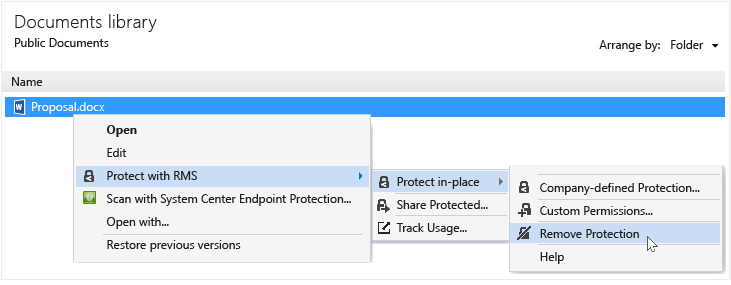

# Fjerne beskyttelsen fra en fil ved hjelp av rettighetsadministrasjon deling av program
Å fjerne beskyttelsen fra en fil (det vil si oppheve beskyttelsen av en fil) som tidligere var beskyttet ved hjelp av RMS deling program, bruker du **fjerne beskyttelse** alternativet fra File Explorer.

> [!IMPORTANT]
> Du må være en eier av filen for å fjerne beskyttelsen.

### Å fjerne beskyttelsen fra en fil

1.  Fra File Explorer, høyreklikk filen (for eksempel Sample.ptxt), velger du **Beskytt med RMS**, klikker du **beskytte på stedet**, og klikk deretter **fjerne beskyttelse**:

    

    Du kan bli bedt om påloggingsinformasjon.

Den opprinnelige beskyttede filen er slettet (for eksempel Sample.ptxt) og erstattet med en fil med samme navn, men den ubeskyttede filtypen (for eksempel Sample.txt).

## Eksempler og andre instruksjoner
For eksempler på hvordan du kan bruke IRM deling av programmet, og hvordan-instruksjoner, kan du se følgende deler fra Rights Management-brukerhåndboken for deling program:

-   [Eksempler for å bruke RMS deling av program](../Topic/Rights_Management_sharing_application_user_guide.md#BKMK_SharingExamples)

-   [Hva vil du gjøre?](../Topic/Rights_Management_sharing_application_user_guide.md#BKMK_SharingInstructions)

## Se også
[Rights Management deling program Brukerhåndbok](../Topic/Rights_Management_sharing_application_user_guide.md)

