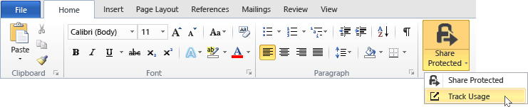
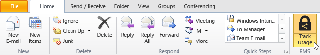
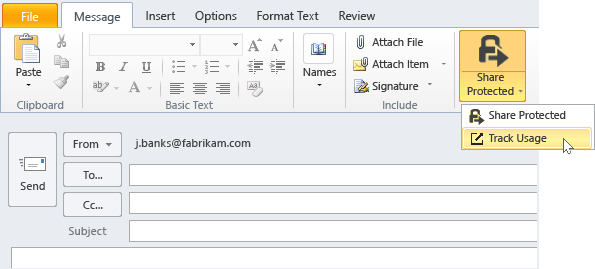

# Spore og oppheve dokumentene n&#229;r du bruker RMS deling av program
Når du har beskyttet dokumenter ved hjelp av RMS deling av programmet, hvis organisasjonen bruker Azure Rights Management i stedet for Active Directory Rights Management Services, kan du spore hvordan folk bruker beskyttede dokumenter. Hvis det er nødvendig, kan du også tilbakekalle tilgangen til disse dokumentene når du vil slutte å dele dem. Hvis du vil gjøre dette, bruker du den **dokumentsporing området**, som du får tilgang til fra Windows-datamaskiner, Mac-datamaskiner, og selv tavler og telefoner.

> [!TIP]
> To minutters video: [Azure RMS-dokumentet sporing og opphevelse](http://channel9.msdn.com/Series/Information-Protection/Azure-RMS-Document-Tracking-and-Revocation)

Når du har tilgang til dette området, kan du logge på til å spore dokumenter. Å gi organisasjonen har en [abonnement som støtter dokumentet sporing og opphevelse](https://technet.microsoft.com/dn858608.aspx) og du er tilordnet en lisens for dette abonnementet, kan du se hvem som forsøkte å åpne filer som du er beskyttet, og om de var vellykket (de ble godkjent) eller ikke. Hver gang de prøvde å få tilgang til dokumentet, og deres plassering på tidspunktet. I tillegg:

-   Hvis du vil slutte å dele et dokument: Klikk **tilbakekalle tilgangen**, Legg merke til hvor lang tid som dokumentet vil fortsatt være tilgjengelig, og bestemme om å fortelle andre at du trekker tilbake tilgang til dokumentet du tidligere har delt, og gir en tilpasset melding.

-   Hvis du vil eksportere til Excel: Klikk **Åpne i Excel**, slik at du kan endre dataene, og lage dine egne visninger og grafer.

-   Hvis du vil konfigurere e-postvarslinger: Klikk **Innstillinger for** og velger du hvordan og om det skal være en e-postmelding når dokumentet åpnes.

-   Hvis du har spørsmål eller ønsker å gi tilbakemelding om dokumentsporing område: Klikk Hjelp-ikonet for å få tilgang til den [Vanlige spørsmål for sporing](http://go.microsoft.com/fwlink/?LinkId=523977).

## Ved hjelp av Office til å få tilgang til sporingsområdet dokumentet

-   For den Office-programmer, Word, Excel og PowerPoint: På den **Hjem** -kategorien i den **RMS** gruppen, klikker du **del beskyttet**, og klikk deretter **Spor Bruk**.

    

-   For Outlook: På den **Hjem** -kategorien i den  **RMS** gruppen, klikker du **Spor Bruk**:

    

Hvis du ikke ser disse alternativene for RMS, er det sannsynlig at enten RMS deling program ikke er installert på datamaskinen, den nyeste versjonen er ikke installert, eller datamaskinen må startes på nytt for å fullføre installasjonen. Hvis du vil ha mer informasjon om hvordan du installerer programmet deling, se [Last ned og installer rettighetsadministrasjon deling av program](../Topic/Download_and_install_the_Rights_Management_sharing_application.md).

### Andre måter å spore og oppheve dokumenter
I tillegg til å spore dokumenter på Windows-maskiner ved hjelp av Office-programmer, kan du også bruke disse alternativene:

-   **Ved hjelp av en web-leser**: Denne metoden fungerer for alle støttede enheter.

-   **Ved hjelp av File Explorer**: Denne metoden fungerer for Windows-datamaskiner.

-   **Ved hjelp av en e-postmelding i Outlook**: Denne metoden fungerer for Windows-datamaskiner.

##### Ved hjelp av en webleser til å få tilgang til sporingsområdet doc

-   Ved hjelp av en webleser som støttes, kan du gå til den [dokumentsporing området](http://go.microsoft.com/fwlink/?LinkId=529562).

    Weblesere som støttes: Vi anbefaler at du bruker Internet Explorer som er minst versjon 10, men du kan bruke noen av følgende nettlesere til dokumentsporing område:

    -   Internet Explorer: Minst versjon 10

    -   Internet Explorer 9 med minst MS12-037: Kumulativ sikkerhetsoppdatering for Internet Explorer: 12. juni 2012

    -   Mozilla Firefox: Minst versjon 12

    -   Apple Safari 5: Minst versjon 5

    -   Google Chrome: Minst versjon 18

##### Ved hjelp av File Explorer tilgang til sporingsområdet dokumentet

-   Høyreklikk filen, velger du **Beskytt med RMS**, og velg deretter **Spor Bruk**:

    

##### Ved hjelp av en e-postmelding i Outlook til å få tilgang til sporingsområdet doc

-   I en e-postmelding, i den **meldingen** -kategorien i den  **RMS** gruppen, klikker du **del beskyttet**, og klikk deretter **Spor Bruk**:

    

## Eksempler og andre instruksjoner
For eksempler på hvordan du kan bruke IRM deling av programmet, og hvordan-instruksjoner, kan du se følgende deler fra Rights Management-brukerhåndboken for deling program:

-   [Eksempler for å bruke RMS deling av program](../Topic/Rights_Management_sharing_application_user_guide.md#BKMK_SharingExamples)

-   [Hva vil du gjøre?](../Topic/Rights_Management_sharing_application_user_guide.md#BKMK_SharingInstructions)

## Se også
[Rights Management deling program Brukerhåndbok](../Topic/Rights_Management_sharing_application_user_guide.md)

