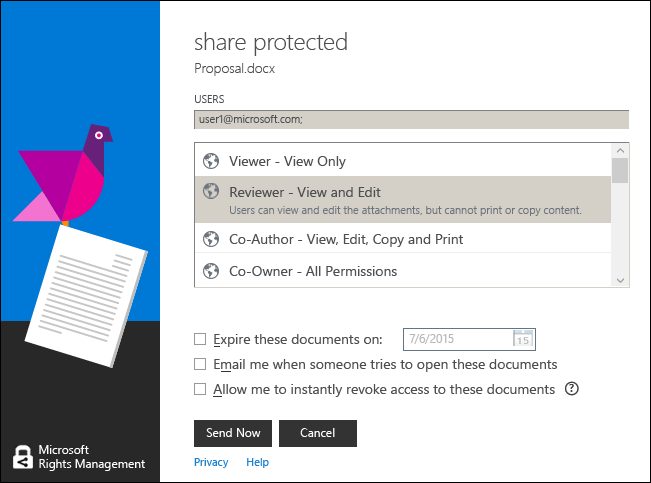

# Bruke hurtigtaster i rettighetsadministrasjon deling av program
Når du bruker RMS deler programmet, trykk på **Alt** Hvis du vil se tilgjengelige tilgangstastene, og trykk deretter **Alt** + hurtigtasten til å velge et alternativ.

For eksempel i den **del beskyttet** dialogboksen, trykker du **Alt** å se tilgangstastene, og trykk deretter **Alt + m** til å velge den **e-post meg når noen prøver å åpne disse dokumentene** merket.

## Eksempler og andre instruksjoner
For eksempler på hvordan du kan bruke IRM deling av programmet, og hvordan-instruksjoner, kan du se følgende deler fra Rights Management-brukerhåndboken for deling program:

-   [Eksempler for å bruke RMS deling av program](../Topic/Rights_Management_sharing_application_user_guide.md#BKMK_SharingExamples)

-   [Hva vil du gjøre?](../Topic/Rights_Management_sharing_application_user_guide.md#BKMK_SharingInstructions)

## Se også
[Rights Management deling program Brukerhåndbok](../Topic/Rights_Management_sharing_application_user_guide.md)

