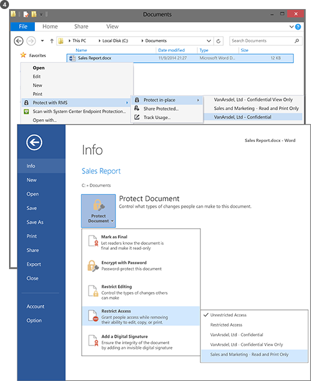
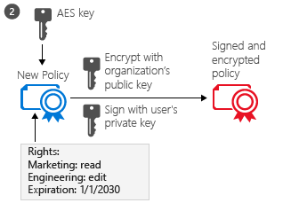

# Hva er Azure Rights Management?
Azure Rights Management (Azure RMS) er en løsning for beskyttelse av informasjon for organisasjoner som vil beskytte sine data i dagens utfordrende arbeidsmiljø.

Disse utfordringene er behovet for å være Internett-tilkoblede brukere å bringe personlige enheten skal fungere, tilgang til firmadataene på veien og Hjem og deling av sensitiv informasjon med viktige forretningspartnere. Som en del av deres daglige arbeid, kan brukere dele informasjon ved hjelp av e-post, webområder for deling av filer, og sky tjenester. I disse scenariene, har tradisjonell sikkerhetskontroller (for eksempel lister og NTFS-tillatelser) og brannmurer begrenset effektiv hvis du vil beskytte dataene selskap mens du fremdeles styrke brukerne til å arbeide effektivt.

Til sammenligning kan Azure RMS beskytte selskapets sensitiv informasjon i disse scenariene. Den bruker kryptering, identitet og retningslinjer for godkjenning til å sikre filer og e-post, og den fungerer på tvers av flere enheter, telefoner, tavler og PCer. Informasjon som kan beskyttes i organisasjonen og utenfor organisasjonen fordi den beskyttelsen fortsetter med data, selv når den forlater grensene for din organisasjon. For eksempel ansatte kan sende e-post et dokument til en partnerselskapet, eller de lagrer et dokument til sine cloud-stasjon. Fast beskyttelse som Azure RMS gir ikke bare bidrar til å sikre dataene selskap, men også kan være lovlig obligatorisk for overholdelse, discovery juridiske krav eller ganske enkelt en god plan metoder.

Men svært viktigere autoriserte personer og tjenester (for eksempel søk og indeksering) kan fortsette å lese og se dataene som beskytter Azure RMS, ikke gjøres lett med andre løsninger for beskyttelse som bruker kryptering for node-til-node. Denne funksjonen blir noen ganger referert til som "logikk over data", og er et viktig element i å beholde kontrollen over organisasjonens data.

Det påfølgende bildet viser hvordan Azure RMS fungerer som en Rights Management-løsning for Office 365 samt lokale servere og tjenester. Du vil også se at den støtter populære sluttbruker-enheter som kjører Windows, Mac OS, iOS, Android og Windows Phone.

> [!TIP]
> Du kan nå finne flere ressurser nyttig:
> 
> -   To minutters video: [Hva er Microsoft Azure Rights Management](http://technet.microsoft.com/dn833005.aspx)
> -   Fem trinn opplæring: [Rask Start opplæring for Azure Rights Management](../Topic/Quick_Start_Tutorial_for_Azure_Rights_Management.md)
> -   Azure RMS-krav, inkludert alternativer for abonnement til å kjøpe eller vurdere: [Krav for Azure Rights Management](../Topic/Requirements_for_Azure_Rights_Management.md)

Bruk delene nedenfor for å lære mer om Azure RMS:

-   [Hvilke problemer løser Azure RMS?](../Topic/What_is_Azure_Rights_Management_.md#BKMK_RMSrequirements)

    -   [Sikkerhet, samsvar og lovbestemte krav](../Topic/What_is_Azure_Rights_Management_.md#BKMK_RMScompliance)

-   [Azure RMS i aksjon: Administratorer og brukere ser](../Topic/What_is_Azure_Rights_Management_.md#BKMK_RMSpictures)

    -   [Aktivere og konfigurere Rights Management](../Topic/What_is_Azure_Rights_Management_.md#BKMK_Example_ManagementPortal)

    -   [Automatisk beskyttelse av filer på filservere som kjører Windows Server og filen klassifisering infrastruktur](../Topic/What_is_Azure_Rights_Management_.md#BKMK_Example_FCI)

    -   [Automatisk beskyttelse av e-post med Exchange Online og datapolicyer tap forebygging](../Topic/What_is_Azure_Rights_Management_.md#BKMK_Example_DLP)

    -   [Automatisk beskyttelse av filer med SharePoint Online og beskyttet biblioteker](../Topic/What_is_Azure_Rights_Management_.md#BKMK_Example_SharePoint)

    -   [Brukere dele trygt vedlegg med mobile brukere](../Topic/What_is_Azure_Rights_Management_.md#BKMK_Example_SharingApp)

-   [Hvordan fungerer Azure RMS? Under panseret](../Topic/What_is_Azure_Rights_Management_.md#BKMK_HowRMSworks)

    -   [Brukes av Azure RMS kryptografiske kontroller: Algoritmer og nøkler](../Topic/What_is_Azure_Rights_Management_.md#BKMK_RMScrytographics)

    -   [Gjennomgang av hvordan Azure RMS fungerer: Bruk først, beskyttelse, innhold forbruk av innhold](../Topic/What_is_Azure_Rights_Management_.md#BKMK_Walthrough)

-   [Neste trinn](../Topic/What_is_Azure_Rights_Management_.md#BKMK_NextSteps)

## Hvilke problemer løser Azure RMS?
Bruk tabellen nedenfor til å identifisere forretningskrav eller problemer som organisasjonen kan ha og hvordan Azure RMS kan løse disse.

|Krav eller problem|Ved Azure RMS|
|----------------------|-----------------|
|Beskytte alle filtyper|√ i forrige implementeringen av Rights Management, bare Office-filer kan være beskyttet, med innebygd beskyttelse. Nå [Generell beskyttelse](https://technet.microsoft.com/library/dn574738%28v=ws.10%29.aspx) betyr at alle filtyper som støttes.|
|Beskytte filer hvor som helst|√ Når en fil lagres på en plassering ([beskytte på stedet](https://technet.microsoft.com/library/dn574733%28v=ws.10%29.aspx)), beskyttelse skal holdes sammen med filen, selv om det er kopiert til lagring som ikke er under kontroll av IT, for eksempel en sky lagring tjeneste.|
|Dele filer på en sikker måte via e-post|√ Når en fil er delt via e-post ([del beskyttet](https://technet.microsoft.com/library/dn574735%28v=ws.10%29.aspx)), filen er beskyttet som et vedlegg til en e-postmelding med instruksjoner hvordan du åpner vedlegget beskyttet. I e-postmeldingen er ikke kryptert, slik at mottakeren kan alltid lese disse instruksjonene. Men fordi det vedlagte dokumentet er beskyttet, vil bare autoriserte brukere kunne åpne den, selv om e-post eller dokumentet blir videresendt til andre personer.|
|Overvåking og overvåking|√ kan du [kontrollere og overvåke bruk av](https://technet.microsoft.com/library/dn529121.aspx) av de beskyttede filene, selv etter at disse filene la grensene for din organisasjon.  For eksempel arbeider du for Contoso, Ltd. Du arbeider på et felles prosjekt med 3 personer fra Fabrikam, Inc. Disse 3 personer e et dokument som du beskytter og begrense til skrivebeskyttet. Azure RMS-overvåking kan gi følgende informasjon:  -   Om personene du har angitt i Fabrikam åpnet dokumentet, og når. -   Om andre personer du ikke angav forsøkte (og mislyktes) til å åpne dokumentet, kanskje fordi den ble videresendt eller lagret på en delt plassering som andre kan få tilgang. -   Om noen av de angitte prøvd (og kan) til å skrive ut eller endre dokumentet.|
|Støtte for alle vanlige enheter, ikke bare Windows-datamaskiner|√ [støttede enheter](https://technet.microsoft.com/library/dn655136.aspx) inkluderer:  -   Windows-maskiner og telefoner -   Mac-datamaskiner -   iOS tavler og telefoner -   Android tavler og telefoner|
|Støtte for bedrift-til-bedrift-samarbeid|√ Fordi Azure RMS er en cloud-tjeneste, er det ikke nødvendig å konfigurere eksplisitt klareringer med andre organisasjoner før du kan dele beskyttet innhold med dem. Hvis de allerede har et Office 365 eller en Azure AD-katalog, støttes automatisk samarbeid på tvers av organisasjoner. Hvis de ikke gjør dette, kan brukerne registrere seg for en gratis [RMS for enkeltpersoner](https://technet.microsoft.com/library/dn592127.aspx) abonnementet.|
|Støtte for lokale tjenester, i tillegg til Office 365|√ i tillegg til å arbeide [sømløst med Office 365](https://technet.microsoft.com/library/jj585004.aspx), kan du også bruke Azure RMS med følgende lokale tjenester når du distribuerer den [RMS-kontakt](https://technet.microsoft.com/library/dn375964.aspx):  -   Exchange Server -   SharePoint Server -   Windows Server som kjører filen klassifisering infrastruktur|
|Enkel aktivering|√ [aktivere Rights Management-tjenesten](https://technet.microsoft.com/library/jj658941.aspx) krever bare et par klikk i Azure portal for brukere.|
|Muligheten til å utvide på tvers av organisasjonen, etter behov|√ Fordi Azure RMS kjører som en skytjeneste med Azure elasticity til å skalere opp og ut, og du trenger ikke å klargjøre eller distribuere flere lokale servere.|
|Muligheten til å opprette policyer for enkel og fleksibel|√ [tilpasset policymaler for rettigheter](https://technet.microsoft.com/library/dn642472.aspx) gir en rask og enkel løsning for administratorer å bruke policyer, og for brukere å bruke riktig nivå av beskyttelse for hvert dokument, og begrense tilgangen til personer i organisasjonen.  For en firmaet strategi papiret som skal deles med alle ansatte, kan du for eksempel bruke en skrivebeskyttet policy til alle interne medarbeidere. Deretter, for en mer følsomme dokument, for eksempel en finansrapport, kan du begrense tilgangen til bare ledere.|
|Bred-støtte|√ Azure RMS har tett integrering med Microsoft Office-programmer og tjenester, og utvider støtte for andre programmer ved hjelp av RMS deling av programmet.  √ Den   [Microsoft Rights Management SDK](https://msdn.microsoft.com/library/hh552972%28v=vs.85%29.aspx) gir APIer til å skrive egendefinerte programmer som støtter Azure RMS interne utviklere og programvareleverandører.  Hvis du vil ha mer informasjon, se [Hvordan programmer støtter Azure rettighetsbehandling](../Topic/How_Applications_Support_Azure_Rights_Management.md).|
|IT må opprettholde kontrollen over data|√ Organisasjoner kan velge å administrere sine egne leier-tasten og bruk av "[bringe din egen nøkkel](https://technet.microsoft.com/library/dn440580.aspx)" (BYOK)-løsning og lagre sine leier nøkkelen i maskinvare sikkerhet moduler (HSMs).  √ Støtte for overvåking og [Trafikklogging](https://technet.microsoft.com/library/dn529121.aspx) slik at du kan analysere for business innsikt, overvåke for misbruk, utfører juridiske analyse og (Hvis du har en lekkasje av informasjon).  √ Delegated access ved hjelp av den [super bruker funksjonen](https://technet.microsoft.com/library/mt147272.aspx) sikrer at IT can alltid tilgang beskyttet innhold, selv om et dokument er beskyttet av en ansatt som deretter forlater organisasjonen. I sammenligning, node-til-node-kryptering løsninger risiko tapende tilgang til data for firmaet.  √ Synkronisere [de katalogattributter som Azure RMS må](https://azure.microsoft.com/documentation/articles/active-directory-aadconnectsync-attributes-synchronized/) å støtte en felles identitet for lokale Active Directory-kontoer ved hjelp av en [directory-synkronisering verktøyet](https://azure.microsoft.com/documentation/articles/active-directory-aadconnect-get-started-tools-comparison/), for eksempel koble til Azure AD.  √ gjør det mulig for enkel pålogging på uten replikere passord til skyen, ved hjelp av AD FS.  √ Organisasjoner har alltid muligheten til å slutte å bruke Azure RMS uten å miste tilgang til innhold som tidligere var beskyttet av Azure RMS. Informasjon om dekommisjonering alternativer, kan du se [Dekommisjonering og deaktivere Azure Rights Management](../Topic/Decommissioning_and_Deactivating_Azure_Rights_Management.md). I tillegg kan organisasjoner som har distribuert Active Directory Rights Management Services (AD RMS) [overføre til Azure RMS](https://technet.microsoft.com/library/dn858447.aspx) uten å miste tilgang til data som tidligere ble beskyttet av AD RMS.|
> [!TIP]
> Hvis du er kjent med den lokale versjonen av Rights Management, Active Directory Rights Management Services (AD RMS), du kan være interessert i sammenligning-tabellen fra [Sammenligne Azure Rights Management og AD RMS](../Topic/Comparing_Azure_Rights_Management_and_AD_RMS.md).

### Sikkerhet, samsvar og lovbestemte krav
Azure RMS støtter følgende sikkerhet, samsvar og lovbestemte krav:

√ Bruk av industristandard kryptografi og støtter FIPS 140-2. Hvis du vil ha mer informasjon, se den [Brukes av Azure RMS kryptografiske kontroller: Algoritmer og nøkler](../Topic/What_is_Azure_Rights_Management_.md#BKMK_RMScrytographics) delen i dette emnet.

√ Støtte for Thales maskinvare sikkerhet moduler (HSMs) til å lagre nøkkelen leier Microsoft Azure data centers. Azure RMS bruker separate sikkerhet verdener for sine datasentre i Nord-Amerika, EMEA (Europa, Midtøsten og Afrika) og Asia, slik at nøklene kan bare brukes i din region.

√ Sertifisert for følgende:

-   ISO/IEC 27001:2013 (inkluderer [ISO/IEC 27018](http://azure.microsoft.com/blog/2015/02/16/azure-first-cloud-computing-platform-to-conform-to-isoiec-27018-only-international-set-of-privacy-controls-in-the-cloud/))

-   Orb 2 SSAE 16/ISAE 3402 attestations

-   HIPAA BAA

-   EU-modell-setningsdel

-   FedRAMP som en del av Azure Active Directory i Office 365-sertifisering, utstedt FedRAMP Agency myndighet til Operate ved HHS

-   DSS PCI-nivå 1

Hvis du vil ha mer informasjon om disse eksterne sertifiseringer, se den [Azure klareringssenteret](http://azure.microsoft.com/support/trust-center/compliance/).

## Azure RMS i aksjon: Administratorer og brukere ser
Bildene i denne delen viser noen vanlige eksempler på hvordan administratorer og brukere se og kan bruke Azure RMS til å beskytte sensitiv eller konfidensiell informasjon.

> [!NOTE]
> I alle disse eksemplene der Azure RMS beskytter data, fortsetter innholdseieren har full tilgang til data (fil eller e-post), selv om brukte beskyttelse gir tillatelser til en gruppe som eier ikke var medlem av, eller selv om du brukte beskyttelse inneholder en utløpsdato.
> 
> På samme måte IT can alltid tilgang til de beskyttede dataene uten begrensninger, ved hjelp av super bruker funksjonen for rettighetsadministrasjon som gir delegert tilgang til autoriserte brukere eller tjenester som du angir. I tillegg, IT kan spore og overvåke forbruk for data som er beskyttet, for eksempel hvem som har tilgang til data og når.

For andre skjermbilder og videoer som viser RMS i bruk, kan du se den [Microsoft Rights Management services portal](http://www.microsoft.com/rms),  [Teamblogg for Microsoft Rights Management (RMS)](http://blogs.technet.com/b/rms), og [curated innhold for Azure RMS på Curah! område](http://curah.microsoft.com/Search?query="Azure%20RMS").

### Aktivere og konfigurere Rights Management
Selv om du kan bruke Windows PowerShell til å aktivere og konfigurere Azure RMS, er det enklest fra management-portalen. Så snart tjenesten er aktivert, har du to standardmaler som administratorer og brukere kan velge å raskt og enkelt bruke informasjonsbeskyttelse av på filer. Men du kan også opprette dine egne tilpassede maler for flere alternativer og innstillinger.

|||
|-|-|
|  [Store bildet](http://technet.microsoft.com/98d53a12-3b19-4622-bb1e-75ef56df5438) (som standard i samme webleservindu)|Du kan bruke enten Office 365 administrasjonssenteret (bilde først) eller Azure portal (andre bildet) for å aktivere RMS.  Bare ett klikk for å aktivere og en annen Klikk for å bekrefte, og deretter informasjonsbeskyttelse er aktivert for administratorer og brukere i organisasjonen.|
|  [Store bildet](http://technet.microsoft.com/596e4fec-124c-41b1-8efd-63d5179193fb) (som standard i samme webleservindu)|Etter aktivering er to rettigheter policymaler automatisk tilgjengelig for organisasjonen. Er en mal for skrivebeskyttet (**bare konfidensiell** er inkludert i navnet), den andre for lese og endre tilgang (**Konfidensielt**).  Disse malene som brukes til filer eller e-post, kan de begrense tilgang til brukere i organisasjonen. Dette er en svært rask og enkel måte å forhindre at firmadataene lekker til personer utenfor organisasjonen. **Tip:** Du kan enkelt gjenkjenne disse standardmalene fordi de er automatisk prefikset navnet på organisasjonen. I vårt eksempel **VanArsdel Ltd,**. Hvis du ikke vil at brukere skal se disse malene, eller hvis du vil opprette dine egne maler, kan du gjøre dette fra Azure portal. Som bildet viser, leder en veiviseren deg gjennom opprettingen av egendefinert mal.|
|  [Store bildet](http://technet.microsoft.com/f5df80e5-efc9-4c0f-91be-060225977356) (som standard i samme webleservindu)|Frakoblet tilgang, utløpsdato innstillinger og om du vil publisere malen umiddelbart (gjøre det synlig i programmer som støtter rettighetsbehandling) er noen av konfigurasjonsinnstillingene tilgjengelige hvis du bestemmer deg for å lage dine egne maler.|
|  [Store bildet](http://technet.microsoft.com/597a3402-fd5a-4bcf-b5e6-5c983dbde697) (som standard i samme webleservindu)|Som et resultat av publiserer disse malene, kan brukere nå velge dem i programmer, for eksempel File Explorer og Microsoft Word:  -   En bruker kan bruke standardmalen, **VanArsdel Ltd. – konfidensielt**. Bare ansatte fra VanArsdel organisasjonen kan deretter åpne og bruke dette dokumentet, selv om den senere en e-postmelding til noen utenfor organisasjonen eller lagret på en felles plassering. -   En bruker kan bruke den egendefinerte malen som administratoren har opprettet, **Salg og markedsføring – Les og Skriv ut bare**. Deretter filen som er beskyttet fra personer utenfor organisasjonen ikke bare, men det er også begrenset til ansatte fra salg og markedsføring. Videre disse ansatte ikke har full tilgang til dokumentet, bare lese og skrive ut. De kan ikke endre eller kopiere fra den.|
Hvis du vil ha mer informasjon, se [Aktivering av Azure Rights Management](../Topic/Activating_Azure_Rights_Management.md) og [Konfigurere egendefinerte maler for Azure Rights Management](../Topic/Configuring_Custom_Templates_for_Azure_Rights_Management.md).

For å hjelpe brukere med å beskytte filer som er viktige for firmaet, kan du se [Hjelpe brukere til å beskytte filer ved hjelp av Azure Rights Management](../Topic/Helping_Users_to_Protect_Files_by_Using_Azure_Rights_Management.md).

Deretter kan du se noen eksempler på hvordan administratorer kan bruke maler for å konfigurere automatisk informasjonsbeskyttelse for filer og e-post.

### Automatisk beskyttelse av filer på filservere som kjører Windows Server og filen klassifisering infrastruktur
Dette eksemplet viser hvordan du kan bruke Azure RMS automatisk beskytte filer på servere som kjører minst Windows Server 2012 og er konfigurert til å bruke filen klassifisering infrastruktur.

Det er mange måter å bruke klassifisering verdier til filer. Du kan for eksempel kontrollere innholdet i filene og bruke tilsvarende innebygde klassifiseringer som konfidensialitet og personlig identifiserbar informasjon. I dette eksemplet oppretter imidlertid en administrator egendefinerte klassifisering av **markedsføring** som skal brukes automatisk på alle brukerdokumenter som er lagret i den **markedsføring reklame** mappen. Selv om denne mappen er beskyttet med NTFS-tillatelser som begrenser tilgang til medlemmer av gruppen markedsføring, administratoren du vet at disse tillatelsene kan gå tapt hvis noen fra gruppen flyttes eller via e-post filer. Informasjonen i filene kan deretter åpnes av uautoriserte brukere.

|||
|-|-|
|  [Store bildet](http://technet.microsoft.com/cf18c56b-c301-4640-8d9e-9e677e494091) (som standard i samme webleservindu)|Administratorene installerer og konfigurerer koblingen RMS (Rights Management), som fungerer som et relay mellom lokale servere og Azure RMS.|
|  [Store bildet](http://technet.microsoft.com/ba3e247d-ea5e-4009-8eac-74f70270ece0) (som standard i samme webleservindu)|På filserveren, administratoren konfigurerer regler for klassifisering og aktiviteter slik at alle brukerfiler i den **markedsføring reklame** mappen er automatisk klassifisert som **markedsføring** og beskyttet av RMS-kryptering.  Hun velger Egendefinert RMS-malen som ble opprettet i vårt første eksempel som begrenser tilgang til medlemmer av salg og markedsføring avdelinger: **Salg og markedsføring – lese og skrive ut bare**.  Som et resultat alle dokumenter i denne mappen er automatisk konfigurert med markedsføring klassifiseringen og beskyttet av salg og markedsføring RMS mal.|
|  [Store bildet](http://technet.microsoft.com/ad666594-68df-4289-835a-235b2af9bf4b) (som standard i samme webleservindu)|Hvordan RMS bidrar til å forhindre at data lekker til personer som ikke skal ha tilgang til sensitiv eller konfidensiell informasjon:  -   Janet, fra markedsføring, e-postmeldinger konfidensielle rapporter fra mappen markedsføring kampanjer. Denne rapporten inneholder nye produktfunksjoner og reklame planer og blir forespurt av en medarbeider som for øyeblikket reiser på business. Imidlertid Janet feilaktig via e-post den til feil person, hun ikke Legg merke til at hun ved et uhell merket en mottaker med lignende navn, i et annet firma.     Mottakeren kan ikke lese rapporten konfidensielt fordi han ikke er medlem av salg og markedsføring gruppe.|
Hvis du vil ha mer informasjon, se [Distribusjon av Azure Rights Management-kobling](../Topic/Deploying_the_Azure_Rights_Management_Connector.md).

### Automatisk beskyttelse av e-post med Exchange Online og datapolicyer tap forebygging
I forrige eksempel viste hvordan du kan beskytte filer som inneholder sensitiv eller konfidensiell informasjon automatisk, men hva hvis informasjonen er ikke i en fil, men i en e-postmelding? Her er der Exchange Online tap forebygging (DLP) datapolicyer, enten å be brukerne bruke informasjonsbeskyttelse (ved hjelp av Policy Tips) eller automatisk ved å bruke den for dem (ved hjelp av Transportregler).

Administratoren konfigurerer en policy for å holde organisasjonen samsvar oss bestemmelser for å beskytte data for personlig identifiserbar informasjon i dette eksemplet, men du kan også konfigurere regler for andre samsvarsreguleringer eller egendefinerte regler som du definerer.

|||
|-|-|
|  [Store bildet](http://technet.microsoft.com/58461319-3981-4b7f-a195-956a1778e907) (som standard i samme webleservindu)|Exchange-malen heter **USA Personlig identifiserbar informasjon (PII) Data** brukes av administratoren til å opprette og konfigurere en ny DLP-policy. Denne malen ser etter informasjon som personnummer og driver lisensnumre i e-postmeldinger.  Reglene er konfigurert slik at e-postmeldinger som inneholder denne informasjonen, og som sendes utenfor organisasjonen automatisk rettighetsbeskyttelse brukt ved å bruke en RMS-mal som begrenser tilgang til bare ansatte i firmaet.  Her regelen er konfigurert til å bruke én av standardmalene som, **VanArsdel Ltd. – konfidensielt**, fra vårt første eksempel. Men du kan også se hvordan valg av maler inkluderer egendefinerte maler du har opprettet, og en **Nei fremover gjør** alternativet som er spesifikk for Exchange.|
|  [Store bildet](http://technet.microsoft.com/bfb0762d-06fb-42e4-beff-eb391f4bedf0) (som standard i samme webleservindu)|Den leder som ansetter, skriver en e-postmelding som inneholder en nylig ansatte personnummer. Han sender denne e-postmeldingen til Sherrie i personalavdelingen.|
|  [Store bildet](http://technet.microsoft.com/59e3b68e-4bed-4962-bb1e-e82d82f8000a) (som standard i samme webleservindu)|Hvis denne e-postmeldingen sendes eller videresendes til noen utenfor organisasjonen, gjelder regelen DLP automatisk rettighetsbeskyttelse.  E-postmeldingen krypteres når den etterlater organisasjonens infrastruktur, slik at e-postadresse i e-postmeldingen ikke kan lese mens du er i transitt, eller i mottakerens innboks. Mottakeren vil ikke kunne lese meldingen, med mindre han eller hun er ansatt en VanArsdel.|
Hvis du vil ha mer informasjon, kan du se følgende deler:

-   [Exchange Online og Exchange Server](../Topic/How_Applications_Support_Azure_Rights_Management.md#BKMK_ExchangeIntro) i den [Hvordan programmer støtter Azure rettighetsbehandling](../Topic/How_Applications_Support_Azure_Rights_Management.md) emnet.

-   [Exchange Online: IRM-konfigurasjonen](../Topic/Configuring_Applications_for_Azure_Rights_Management.md#BKMK_ExchangeOnline) i den [Konfigurere programmer for Azure Rights Management](../Topic/Configuring_Applications_for_Azure_Rights_Management.md) emnet.

### Automatisk beskyttelse av filer med SharePoint Online og beskyttet biblioteker
Dette viser hvordan du enkelt kan beskytte dokumenter når du bruker SharePoint Online og beskyttet biblioteker.

I dette eksemplet er SharePoint-administratoren for Contoso opprettet et bibliotek for hver avdeling som de bruker til å sentralt lagre og sjekke ut dokumenter for redigering og versjonskontroll. Det er for eksempel et bibliotek for salg, én for markedsføring, én for menneskelige ressurser og så videre. Når et nytt dokument lastes opp eller opprettet på en av disse bibliotekene som er beskyttet, dokumentet arver beskyttelse av biblioteket (ikke nødvendig å velge en rettighetsmal policy), og dette dokumentet er beskyttet automatisk og forblir beskyttet, selv om den er flyttet utenfor SharePoint-biblioteket.

|||
|-|-|
|  [Store bildet](http://technet.microsoft.com/2fc90989-9289-4431-9e6a-07740b7f6e5a) (som standard i samme webleservindu)|Administratoren aktiverer IRM (Information Rights Management) for SharePoint-området.|
|  [Store bildet](http://technet.microsoft.com/a18f2e99-5ac4-4103-a88c-527846374091) (som standard i samme webleservindu)|Deretter kan hun Rights Management for et bibliotek. Selv om det er flere alternativer, enkel innstillingen er ofte det som er nødvendig.  Når dokumenter lastes ned nå fra dette biblioteket, blir de automatisk beskyttet av Rights Management, arver beskyttelsen som er konfigurert for biblioteket.|
|  [Store bildet](http://technet.microsoft.com/0ebd6806-0190-441e-84db-72ac4b97e4a2) (som standard i samme webleservindu)|Når noen fra salgsavdelingen sjekker ut denne salgsrapport fra biblioteket, kan de tydelig se fra informasjon-banner på toppen at det er et beskyttet dokument med begrenset tilgang.  Dokumentet forblir beskyttet, selv om brukeren endrer navn på den, lagrer den i et annet sted eller deler dem via e-post. Uansett hva filen heter, der den er lagret, eller om den deles via e-post, kan bare medlemmer av salgsavdelingen lese den.|
Hvis du vil ha mer informasjon, kan du se følgende deler:

-   [SharePoint Online og SharePoint Server](../Topic/How_Applications_Support_Azure_Rights_Management.md#BKMK_SharePointIntro) i den [Hvordan programmer støtter Azure rettighetsbehandling](../Topic/How_Applications_Support_Azure_Rights_Management.md) emnet.

-   [SharePoint Online- og OneDrive for bedrifter: IRM-konfigurasjonen](../Topic/Configuring_Applications_for_Azure_Rights_Management.md#BKMK_SharePointOnline) i den [Konfigurere programmer for Azure Rights Management](../Topic/Configuring_Applications_for_Azure_Rights_Management.md) emnet.

### Brukere dele trygt vedlegg med mobile brukere
De forrige eksemplene viste hvordan administratorer kan bruke automatisk informasjonsbeskyttelse for sensitive og konfidensielle data. Men det vil være noen anledninger når brukere må kanskje bruke denne beskyttelsen seg selv. For eksempel de samarbeider med partnere i en annen organisasjon, må de egendefinerte tillatelser eller innstillinger som ikke er definert i maler for eller ad-hoc situasjoner som ikke dekkes av eksemplene ovenfor. I slike tilfeller kan brukere bruke RMS-malene seg selv eller konfigurere egendefinerte tillatelser.

Dette eksemplet viser hvordan brukere kan enkelt dele et dokument med noen de samarbeider med fra et annet firma, men fremdeles kunne beskytte dokumentet, og være trygg på at mottakeren kan lese den, selv fra en mobil enhet som er populære. Dette scenarioet bruker Rights Management deling programmet, som du kan distribuere automatisk til Windows-maskiner i organisasjonen. Eller brukere kan installere det selv.

I dette eksemplet Anne fra Contoso, via e-post et konfidensielt dokument hun sender til Bjørn på Fabrikam. Han leser dokumentet på sin iPad, men han kan like enkelt lese den på en iPhone, en Android tavle eller telefon en Mac-datamaskin eller en Windows eller datamaskinen.

|||
|-|-|
|  [Store bildet](http://technet.microsoft.com/feeef78d-3c2e-432b-817d-d06f784be226) (som standard i samme webleservindu)|Fra hennes Windows PC Anne oppretter en standard e-postmelding og legger ved et dokument.  Hun klikker **dele beskyttet** på båndet, som laster inn den **del beskyttet** dialogboksen fra RMS deling av programmet.  Anne vil begrense Bob til visning og redigering av dokumentet, og ikke vil ha ham til å kopiere eller skrive det ut, slik at hun velger **REDAKTØR – Vis og rediger**. Hun vil også være en e-postmelding når noen prøver å åpne dokumentet, og har muligheten til å trekke tilbake dokumentet senere om nødvendig, og vet at tilbakekalling trer i kraft umiddelbart.|
|  [Store bildet](http://technet.microsoft.com/e748fd78-8bba-4168-96cf-f96def078283) (som standard i samme webleservindu)|BOB ser e-posten på sin iPad.  I tillegg til Karis meldingen og vedlegg er instruksjonene som han følger for å registrere deg og installerer RMS deling app på sin iPad.|
|  [Store bildet](http://technet.microsoft.com/7dba5ff9-a61d-4a83-8adc-d6ffb0e85df6) (som standard i samme webleservindu)|Bjørn kan nå åpne vedlegget. Han er først bedt om å logge på å bekrefte at han er den tiltenkte mottakeren.  Når Bob viser dokumentet, ser han også begrenset tilgang informasjonen som forteller ham han ikke kan vise og redigere dokumentet, men kopiere eller skrive ut.|
|  [Store bildet](http://technet.microsoft.com/9f642a2e-58ad-44ab-9f81-f890d15380f9) (som standard i samme webleservindu)|Anne mottar en e-postmelding som forteller henne Bob åpnet dokumentet som hun har sendt, og når han tilgang til dokumentet.  Hvis Bob videresender hans e-post med vedlegget eller lagrer den der andre har tilgang til den, eller den er fanget opp på nettverket, kan ikke andre personer lese dokumentet.|
Hvis du vil ha mer informasjon, se [beskytte en fil du deler via e-post](https://technet.microsoft.com/library/dn574735.aspx) og [visning og bruke filer som er beskyttet](https://technet.microsoft.com/library/dn574741.aspx) fra den [Rights Management deling Brukerhåndbok for programmet](https://technet.microsoft.com/library/dn339006.aspx).

I tillegg til [Rask Start opplæring for Azure Rights Management](../Topic/Quick_Start_Tutorial_for_Azure_Rights_Management.md) inneholder trinnvise instruksjoner for dette scenariet.

Nå du har sett noen eksempler på hva som kan gjøre Azure RMS, kan du være interessert i hvordan det fungerer. Hvis du vil ha teknisk informasjon om hvordan Azure RMS fungerer, kan du se den neste delen.

## Hvordan fungerer Azure RMS? Under panseret
En viktig ting å forstå om hvordan Azure RMS fungerer er at Rights Management-tjenesten (og Microsoft) ikke se eller lagre data som en del av prosessen informasjon beskyttelse. Informasjon som du beskytter aldri sendt til eller lagret i Azure, med mindre du eksplisitt lagrer den i Azure eller bruke en annen cloud-tjeneste som lagrer den i Azure. Azure RMS ganske enkelt, blir dataene i et dokument uleselig for alle bortsett fra autoriserte brukere og tjenester:

-   Dataene krypteres på programnivå, og inkluderer en policy som definerer godkjent bruk for dokumentet.

-   Når et beskyttet dokument brukes av en lovlig bruker, eller den er behandlet av en autorisert service, dekrypteres dataene i dokumentet, og rettighetene som er definert i policyen trer i kraft.

På et høyt nivå, kan du se hvordan dette gjøres i følgende bilde. Et dokument som inneholder den hemmelig formelen er beskyttet, og deretter åpnet av en autorisert bruker eller tjeneste. Dokumentet er beskyttet av en innhold nøkkel (grønn-tasten på dette bildet). Det er unikt for hvert dokument, og er plassert i filhodet der den er beskyttet av RMS leier rotnøkkelen (rød nøkkelen i bildet). Leier nøkkelen kan genereres og administreres av Microsoft, eller du kan generere og behandle leier nøkkelen.

Gjennom hele beskyttelse prosessen når Azure RMS er kryptering og dekryptering, godkjenning og fremtvinge begrensninger, hemmelige formelen ikke blir sendt til Azure.

For en detaljert beskrivelse av hva som skjer, kan du se den [Gjennomgang av hvordan Azure RMS fungerer: Bruk først, beskyttelse, innhold forbruk av innhold](../Topic/What_is_Azure_Rights_Management_.md#BKMK_Walthrough) delen i dette emnet.

Hvis du vil ha tekniske detaljer om algoritmer og nøkler som Azure RMS-bruker, kan du se den neste delen.

### Brukes av Azure RMS kryptografiske kontroller: Algoritmer og nøkler
Selv om du ikke trenger å kjenne deg selv hvordan fungerer RMS, blir du kanskje spurt om kryptografiske kontroller som bruker den til å forsikre deg om at sikkerhetsbeskyttelse industristandard.

|||
|-|-|
|Dokumentasjonen beskyttelse metode:|Algoritme: AES  Nøkkellengde: 128 bits og 256 bits 1|
|Nøkkelbeskyttelse metode:|Algoritme: RSA  Nøkkellengde: 2048 biter|
|Sertifikatsignering:|Algoritme: SHA-256|
1 256 biter brukes av rettighetsadministrasjon deling program for generell beskyttelse og innebygd beskyttelse når filen har en .ppdf filtype eller er en beskyttet fil tekst eller bilde (for eksempel .ptxt eller .pjpg).

### Gjennomgang av hvordan Azure RMS fungerer: Bruk først, beskyttelse, innhold forbruk av innhold
For å forstå i detalj hvordan Azure RMS fungerer, la oss gå gjennom en vanlig flyt etter den [Azure RMS-tjenesten er aktivert](https://technet.microsoft.com/library/jj658941.aspx) og når en bruker første gang RMS på deres Windows-datamaskin (noen ganger kalt **under initialisering av miljøet bruker** eller ved oppstart), **beskytter innholdet** (et dokument eller e-post), og deretter **forbruker**  (åpner og bruker) innhold som er beskyttet av en annen.

Etter at brukeren miljøet er initialisert, kan brukeren deretter beskytte dokumenter eller bruke beskyttede dokumenter på datamaskinen.

> [!NOTE]
> Hvis denne brukeren går til en annen Windows-datamaskin, eller en annen bruker bruker samme Windows datamaskin, gjentas initialiseringsprosessen.

#### Initialisering av brukermiljø
Før en bruker kan beskytte innhold eller forbruke beskyttet innhold på en Windows-datamaskin, må brukeren miljøet være forberedt på enheten. Dette er en engangs prosess og skjer automatisk uten brukermedvirkning når en bruker prøver å beskytte eller forbruker beskyttet innhold:

|||
|-|-|
||RMS-klienten på datamaskinen først kobles til Azure RMS, og godkjenner brukeren ved hjelp av deres Azure Active Directory-konto.  Når brukerens konto er samlet med Azure Active Directory, denne godkjenningen er automatisk, og brukeren blir ikke spurt etter legitimasjon.|

|||
|-|-|
||Når brukeren er godkjent, er tilkoblingen automatisk videresendt til organisasjonens RMS leier som problemer sertifikater som brukeren kan godkjenne Azure RMS for å kunne bruke beskyttet innhold, og for å beskytte innhold i frakoblet modus.  En kopi av brukerens sertifikat lagres i Azure RMS, slik at hvis brukeren flytter til en annen enhet, sertifikatene er opprettet ved hjelp av de samme nøklene.|

#### Beskyttelse av innhold
Når en bruker beskytter et dokument, tar RMS-klienten følgende handlinger på en ubeskyttet dokument:

|||
|-|-|
||RMS-klient oppretter en tilfeldig tast (content-nøkkel) og krypterer dokumentet med denne nøkkelen med symmetrisk kryptering AES-algoritmen.|

|||
|-|-|
||RMS-klienten oppretter deretter et sertifikat som inneholder en policy for dokumentet, enten basert på en mal, eller ved å angi bestemte rettigheter for dokumentet. Denne policyen inneholder rettigheter for forskjellige brukere eller grupper og andre begrensninger, for eksempel en utløpsdato.  RMS-klienten bruker deretter organisasjonens nøkkelen som ble hentet når brukeren miljøet ble initialisert, og bruker denne nøkkelen til å kryptere policyen og den symmetriske nøkkelen som innhold. RMS-klienten logger også policy med brukerens sertifikat som ble hentet når brukeren miljøet ble initialisert.|

|||
|-|-|
||Til slutt, bygger RMs-klienten policyen til en fil med i brødteksten til dokumentet kryptert tidligere, som sammen utgjør et beskyttet dokument.  Dette dokumentet kan lagres hvor som helst eller deles ved hjelp av en av metodene, og policyen forblir alltid med kryptert dokument.|

#### Innhold forbruk
Når en bruker ønsker å bruke et beskyttet dokument, starter RMS-klienten som ber om tilgang til Azure RMS-tjenesten:

|||
|-|-|
||Den godkjente brukeren sender policy for dokumentnummer og brukerens sertifikater til Azure RMS. Tjenesten dekrypterer evaluerer policyen og bygger en liste med rettigheter (Hvis noen) brukeren har for dokumentet.|

|||
|-|-|
||Tjenesten trekker deretter ut nøkkelen AES innhold fra den dekrypterte policyen. Denne nøkkelen er deretter kryptert med brukerens fellesnøkkel RSA-nøkkel som er innhentet med forespørselen.  Nøkkelen for kryptert på nytt innhold bygges deretter inn i en kryptert brukerlisens med liste over brukerrettigheter, som deretter blir returnert til RMS-klienten.|

|||
|-|-|
||Til slutt RMS-klienten tar krypterte brukerlisensen og dekrypterer den med sin egen private nøkkel for brukeren. Dette gjør at RMS-klienten dekryptere dokumentets brødtekst som det er nødvendig, og gjengi det på skjermen.  Klienten også dekrypterer liste over tilgangsrettigheter og sender dem til programmet, som håndhever de rettighetene i programmets brukergrensesnitt.|

#### Variasjoner
Foregående gjennomgangene dekker standard scenarier, men det finnes noen variasjoner:

-   **Mobile enheter**: Når mobile enheter beskytte eller bruke filer med Azure RMS, er flyter de prosessen mye enklere. Mobile enheter gå ikke først gjennom initialiseringsprosessen bruker fordi i stedet hver transaksjon (for å beskytte eller forbruker innhold) er uavhengig. Med Windows-datamaskiner, mobile enheter koble til tjenesten Azure RMS og godkjenne. For å beskytte innhold, mobile enheter sender en policy og Azure RMS sender dem en lisens for publisering og symmetriske nøkkelen til å beskytte dokumentet. Hvis du vil bruke innhold, når mobilenheter kobler til tjenesten Azure RMS og godkjenne, de sender policy for dokumentnummer til Azure RMS og be om en brukerlisens forbruker dokumentet. I svaret sender Azure RMS nødvendige nøklene og begrensningene til mobile enheter. Begge prosesser bruker TLS til å beskytte nøkkelutvekslingen og annen kommunikasjon.

-   **RMS connector**: Når det brukes Azure RMS med RMS-kobling, forblir de samme prosess-flyter. Den eneste forskjellen er at koblingen fungerer som et relay mellom lokale tjenester (for eksempel Exchange Server og SharePoint Server) og Azure RMS. Selve koblingen utfører ikke noen operasjoner, for eksempel initialiseringen av brukermiljø, eller kryptering eller dekryptering. Den ganske enkelt formidler kommunikasjon som vanligvis ville gå til en AD RMS-server, som håndterer oversettelsen mellom protokollene som skal brukes på hver side. Dette scenariet kan du bruke Azure RMS med lokale tjenester.

-   **Generell beskyttelse (.pfile)**: Når Azure RMS generisk beskytter en fil, er flyten i hovedsak det samme for innholdsbeskyttelse bortsett fra at RMS-klient oppretter en policy som gir alle rettigheter. Når filen er brukt, er den dekryptert, før den sendes til målprogrammet. Dette scenariet kan du beskytte alle filer, selv om de ikke opprinnelig støtte RMS.

-   **Beskyttet PDF-fil (.ppdf)**: Når Azure RMS beskytter opprinnelig en Office-fil, opprettes det en kopi av filen og også beskytter den på samme måte. Den eneste forskjellen er at kopiering av fil i filformatet for PPDF, som RMS deling programmet vet hvordan du åpner bare for visning. Denne situasjonen kan du sende beskyttet vedlegg via e-post, hvis du vet at mottakeren på en mobil enhet alltid skal kunne lese dem, selv om den mobile enheten ikke har et program som støtter beskyttet Office-filer.

## Neste trinn
Hvis du vil vite mer om Azure RMS, kan du bruke de andre emnene i den [Komme i gang med Azure Rights Management](../Topic/Getting_Started_with_Azure_Rights_Management.md) delen, som [Hvordan programmer støtter Azure rettighetsbehandling](../Topic/How_Applications_Support_Azure_Rights_Management.md) å finne ut hvordan dine eksisterende programmer kan integrere med Azure RMS å tilby en løsning for beskyttelse av informasjon. Se gjennom [Terminologi for Azure Rights Management](../Topic/Terminology_for_Azure_Rights_Management.md) slik at du er kjent med betingelsene du kanskje kommer over når du konfigurerer og bruker Azure RMS, og være sikker på å også av [Krav for Azure Rights Management](../Topic/Requirements_for_Azure_Rights_Management.md) før du starter distribusjonen. Hvis du vil kaste høyre i og prøve det selv, kan du bruke den [Rask Start opplæring for Azure Rights Management](../Topic/Quick_Start_Tutorial_for_Azure_Rights_Management.md).

Hvis du er klar til å starte distribusjon av Azure RMS for organisasjonen, bruker du [Veikart for Azure Rights Management-distribusjon](../Topic/Azure_Rights_Management_Deployment_Roadmap.md) for distribusjon av trinnene og koblinger for hvordan-instruksjoner.

> [!TIP]
> Hvis du vil ha mer informasjon og hjelp, kan du bruke ressurser og koblinger i [Informasjon og støtte for Azure Rights Management](../Topic/Information_and_Support_for_Azure_Rights_Management.md).

## Se også
[Komme i gang med Azure Rights Management](../Topic/Getting_Started_with_Azure_Rights_Management.md)

